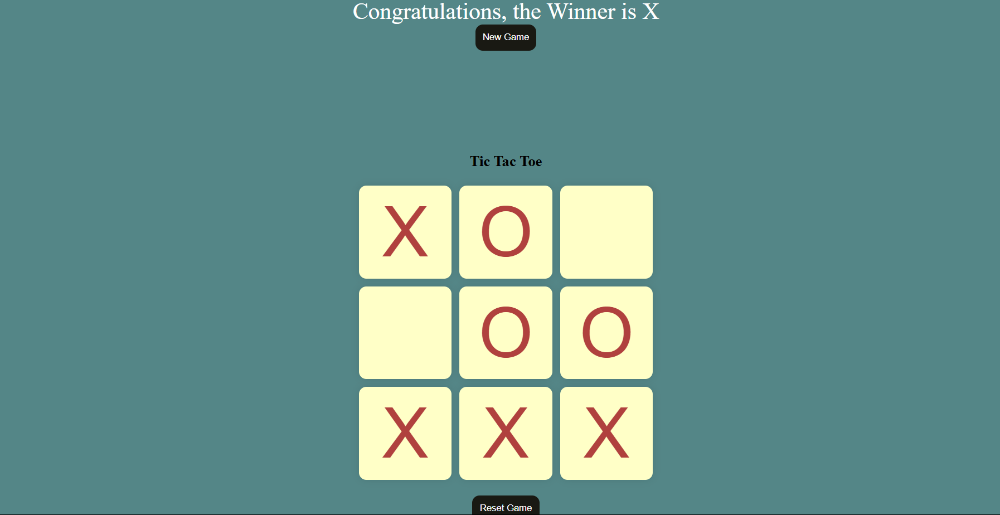

# 🎮 Tic Tac Toe Game

This is a classic Tic Tac Toe game built using HTML, CSS, and JavaScript. It allows two players to take turns marking X and O on a 3x3 grid with real-time win detection and game reset functionality.

---

## 📸 Demo

  
> *(Replace this with your actual screenshot of the game.)*

---

## 🚀 Features

- Two-player game logic (X vs O)
- Win/draw detection
- Game reset button
- Responsive design
- Simple and clean UI

---

## 🛠️ Built With

- **HTML5**
- **CSS3**
- **JavaScript (Vanilla)**

---

## 📁 Folder Structure

## 📄 License
- This project is licensed under the MIT License.

## 🙌 Acknowledgements

- Inspired by the timeless classic game of Tic Tac Toe.
- Developed as a beginner project to practice JavaScript game logic.

## ✨ Author
- Anshul Singh
- GitHub: anshul9739
- Email: anshul9739@gmail.com